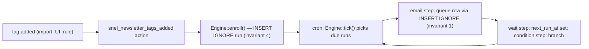
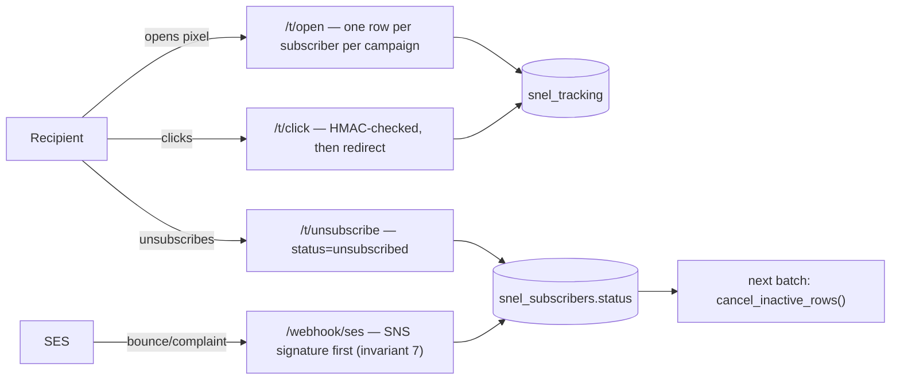

# Snel Newsletter: how the data works

Two layers: how data **moves** (the core flows) and what structures **look like**
(tables, post meta, options). Typed shapes live in the code; this file holds what
the code cannot show.

Rule: change a table, meta key or flow, update this file in the same change.

## Invariants (never break these)

Enforced in the database where possible; the line notes where each one lives.

1. A subscriber receives a campaign at most once.
   UNIQUE (campaign_id, subscriber_id) on `snel_send_queue` + INSERT IGNORE.
2. Only `active` subscribers are ever mailed.
   Audience queries filter on status; the batch fetch must too (fix b).
3. A cancelled campaign never sends, even with rows still pending.
   Checked per row in `Processor::send_row()`.
4. A subscriber enters an automation at most once.
   UNIQUE (automation_id, subscriber_id) on `snel_automation_runs` + INSERT IGNORE.
5. A campaign in tags-mode with no saved tags queues NOBODY, never everyone.
   Guard in `Processor::audience_ids()` (the July race).
6. One queue row is sent by exactly one process.
   Row claiming in the batch fetch (`SOT:CLAIM`).
7. A public endpoint verifies the sender before acting on the payload.
   SNS signature check first in `SESAdapter::parse_webhook()`.

## Core flows

### 1. Broadcast: publish to inbox

```mermaid
flowchart LR
    A[Publish in editor] --> B["shutdown: queue_campaign()"]
    B --> C["audience_ids() — filters win over tags, active only"]
    C --> D["one pending row per recipient (INSERT IGNORE)"]
    D --> E["apply_cooldowns() — one UPDATE, recent receivers to delayed"]
    E --> F["cron every minute: process_batch()"]
    F --> G["claim_batch() SOT:CLAIM — rows to processing"]
    G --> H["send_row(): EmailTemplate::render -> adapter -> SES"]
    H --> I["row sent + message_id; finalize when queue empties"]
```



Guards on the way: `cancel_inactive_rows()` (invariant 2), campaign-cancelled
check per row (invariant 3), lane budget from `Warmup\Guard::daily_remaining()`.

### 2. Automation: tag to sequence



Automation emails ride the same send queue as broadcasts, on the `automation`
lane (own sender domain, own warmup budget).

### 3. Tracking: the way back



Stats shown in the UI come from cached postmeta refreshed during batches;
`snel_tracking` is the source of truth (see PLAN.md, stale-stats fix).

## Tables

All prefixed with `{$wpdb->prefix}snel_`. Created by `SOT:INSTALL`
(`inc/core/install.php`); each module owns its schema in `Install.php`.

| Table | Owner | Holds |
|---|---|---|
| `subscribers` | subscribers | one row per email address, with status |
| `subscriber_tags` | subscribers | tag ↔ subscriber links |
| `tag_rules` | subscribers | manual vs dynamic tag definitions |
| `send_queue` | queue | one row per (campaign, subscriber) to send; warmup adds `delayed_until` |
| `tracking` | tracking | opens and clicks |
| `newsletter_logs` | logger | plugin log lines |
| `automations` | automations | automation definitions (steps as JSON) |
| `automation_runs` | automations | one row per subscriber enrolled in an automation |
| `automation_events` | automations | history per run |

Columns are documented per table as we walk through each module.

### subscribers (`SOT:SUBSCRIBER-SCHEMA`, `inc/subscribers/Install.php`)

| Table | Columns | Notes |
|---|---|---|
| `snel_subscribers` | `id`, `email` (unique), `name`, `status`, `unsubscribe_token`, `created_at` | `status`: `active`, `unsubscribed`, `bounced`, `complained`. Only `active` ever receives mail. |
| `snel_subscriber_tags` | `subscriber_id`, `tag` | unique per pair; one subscriber, many tags |
| `snel_tag_rules` | `tag` (unique), `type`, `metric`, `operator`, `threshold` | `type` `static` = assigned by hand; `dynamic` = auto-assigned when `metric operator threshold` holds, e.g. `open_rate > 50` |

## Warmup options (`wp_options`)

Per lane (`broadcast`, `automation`): `snel_warmup_{lane}_enabled`,
`snel_warmup_{lane}_started_at` (date the ramp began),
`snel_warmup_{lane}_daily_sent` + `_daily_date` (today's counter).
Queue statuses driven by warmup: `delayed` (+ `delayed_until`), and the
claim adds `processing` (+ `claimed_at`). Lifecycle of a queue row:
pending → processing → sent | retrying (3x) → failed; or delayed → pending;
or cancelled (unsubscribed, campaign cancelled).

## Source configs

One option (`snel_newsletter_cpt_sources`) holds every configured source, keyed
by id. Real example:

```
inquiry:                        <- the contact form post type
  kind:        cpt              <- or `custom` for an own table
  email_field: _inquiry_email   <- which meta key holds the address
  manual_tags: []               <- tags every import gets
  auto_sync:   true             <- hourly cron + on save_post
  last_result: {imported, tagged, skipped, invalid, junk}
```

Flow: new post/row -> `Importer` reads the email field -> junk check
(`Validator`) -> exists? tag only : create subscriber. Counters land in
`last_result`, shown on the Sources page.

## Post meta (`snel_newsletter` posts)

A campaign is a WordPress post of type `snel_newsletter` (`SOT:CAMPAIGN-CPT`,
`inc/core/cpt.php`). Extra fields live in `wp_postmeta`, all prefixed `_snel_nl_`.

Written by the editor sidebar (registered with `show_in_rest`):

| Meta | Type | Holds |
|---|---|---|
| `_snel_nl_tags` | array | chosen tags, e.g. `["all"]` |
| `_snel_nl_audience` | string | `tags` or `filters` |
| `_snel_nl_audience_filters` | array | filter rules for a custom list |
| `_snel_nl_is_workflow` | bool | campaign belongs to an automation |

These four decide who receives the campaign; the queue reads them at publish.

Written by PHP during/after sending (campaigns module reads these for the list):

| Meta | Holds |
|---|---|
| `_snel_nl_send_status` | `sending` while queue rows remain, `sent` after finalize, `cancelled` |
| `_snel_nl_total_recipients` / `_snel_nl_sent_count` | progress counters |
| `_snel_nl_opened` / `_snel_nl_clicked` | cached from `snel_tracking`; can lag (see PLAN.md) |
| `_snel_nl_preview_text` | preheader; currently never saved by the editor (red issue 5) |

Workflow campaigns (steps of an automation) are recognized by their id appearing
in an automation's `steps` JSON, not by meta alone; their stats are read live
from `snel_tracking` instead of the cached meta.

The mail body IS `post_content`, rendered fresh for every send. Editing a
campaign while its queue is still draining changes what late recipients get.
